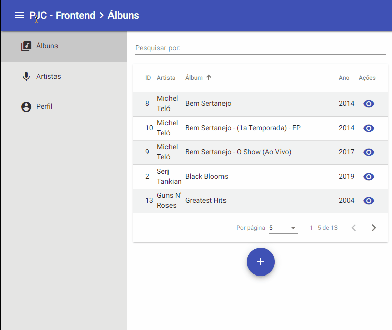
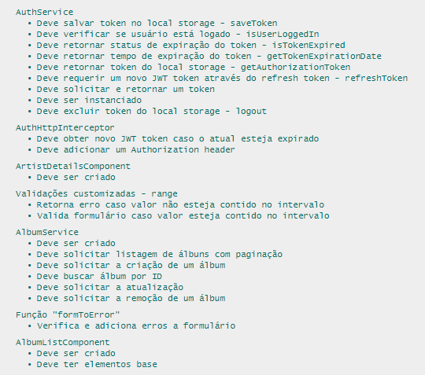

# Teste Prático - Frontend

Esse projeto foi construído com Angular 11. 

Devido principalmente a falta de tempo e prática, nem todos os critérios da avaliação foram alcançados, como o uso de padrões PWA ou testes automatizados robustos em todos arquivos.

<p align="center">
  
</p>

<h4 align="center">
  <a href="#started" >
    Instalação
  </a>
  |
  <a href="#tests" >
    Testes Automatizados
  </a>
  |
  <a href="#utils" >
    Utilidades
  </a>
  |
  <a href="#license" >
    Licença
  </a>
</h4>

<h2 name="started">🔧 Instalação</h2>

Clone ou baixe o projeto do Github

```bash
git clone https://github.com/steferson-augusto/pjc_teste_pratico_frontend.git
```

Abra o diretório do projeto e execute `npm install`.

Na raiz do projeto, execute `ng build --aot --prod` (certifique-se de possuir o Angular-CLI instalado)

Ainda na raiz do projeto, execute `docker-compose up`.

Após a montagem do container, a aplicação estará pronta para uso através de `http://localhost:8081/`

Após iniciado, certifique-se de que existe um bucket chamado `miniotest` em `https://play.min.io/minio/`, caso contrário não será possível adicionar imagens de capa a um álbum.

Não há maneiras de cadastrar usuário e só existe um usuário cadastrado pela API. O acesso é:

<b>Email:</b> superuser@email.com

<b>Senha:</b> aIJUyry6D7wZleDm

<br/>
<h2 name="tests">🔧 Testes Automatizados</h2>

Para executar testes automatizados basta executar o seguinte comando:

```js
ng test
```

<p align="center">
  
</p>

<br/>
<h2 name="utils">📏 Utilidades</h2>

<ul>
  <li>
    <a href="https://angular.io/docs" target="_blank">Angular</a>
    - documentação oficial
  </li>

  <li>
    <a href="https://material.angular.io/components/categories" target="_blank">Angular Material</a> - documentação oficial
  </li>

  <li>
    <a href="https://www.npmjs.com/package/ngx-owl-carousel-o" target="_blank">ngx-owl-carousel-o</a> - documentação oficial
  </li>
</ul>

<br/>
<h2 name="license">📝 Licença</h2>
<p>Este projeto está sob uma licença MIT. Veja mais informações em <a href="https://github.com/steferson-augusto/pjc_teste_pratico_frontend/blob/master/LICENSE" target="_blank">LICENSE</a>.</p>

---

<p>Criado por <a href="https://www.linkedin.com/in/st%C3%A9ferson-augusto-4b0b9b124/" target="_blank">Stéferson Augusto</a></p>
